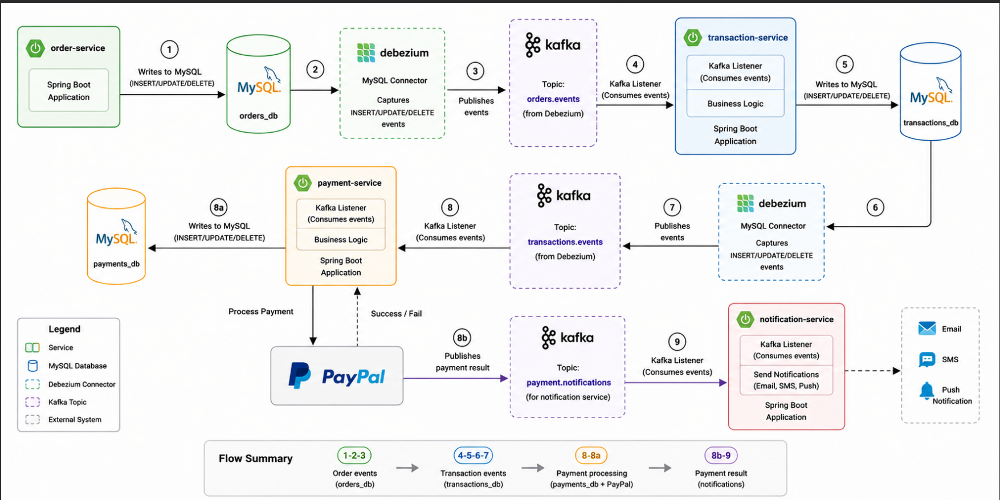

# Order Platform Overview


# order-service

## Overview

The Order Service is responsible for managing customer orders.
It persists order data in MySQL and publishes database changes through Debezium.
Other microservices consume these events to continue the business workflow.

## Architecture

The service participates in the following event-driven flow:

Order Service -> MySQL -> Debezium -> Kafka Topic -> Transaction Service

## Features
- Create orders
- Update orders
- Cancel orders
- Persist data in MySQL
- Publish database changes via Debezium
- REST API

## Technology Stack

- Java 21
- Spring Boot 3
- Spring Data JPA
- MySQL
- Kafka
- Debezium
- Docker
- Maven

## Configuration

## Configuration

The application uses environment variables.

| Variable | Description |
|-----------|-------------|
| DB_HOST | MySQL host |
| DB_PORT | MySQL port |
| DB_USERNAME | Database username |
| DB_PASSWORD | Database password |
| KAFKA_BOOTSTRAP_SERVERS | Kafka broker |

## Running the Application

```bash
docker compose up -d
```

## API Documentation

Swagger UI
http://localhost:8081/swagger-ui/index.html

## Event Flow

1. Order Service saves data in MySQL.
2. Debezium detects INSERT, UPDATE and DELETE operations.
3. Debezium publishes events to Kafka.
4. Transaction Service consumes the events.